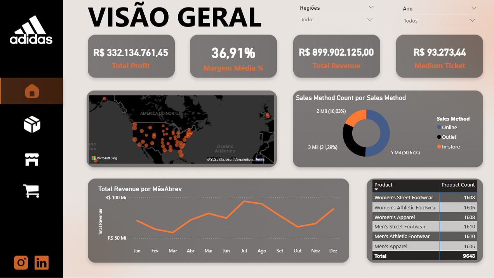
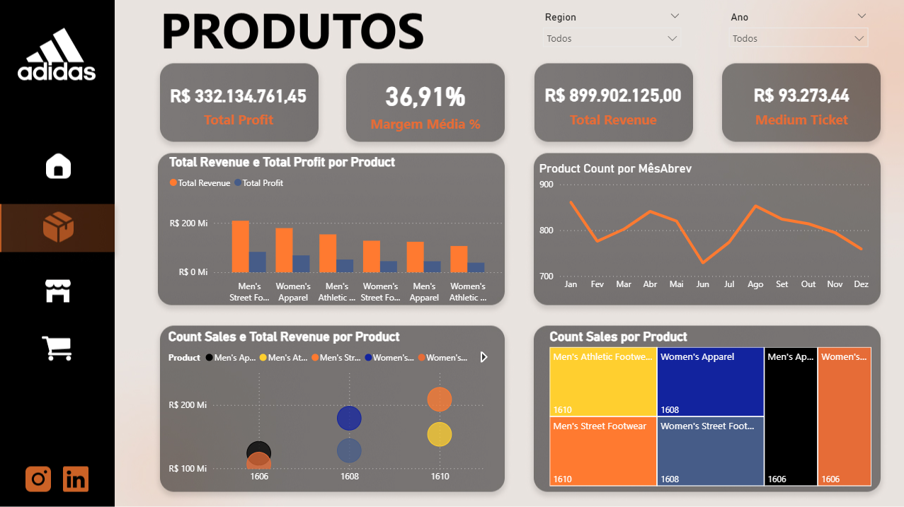
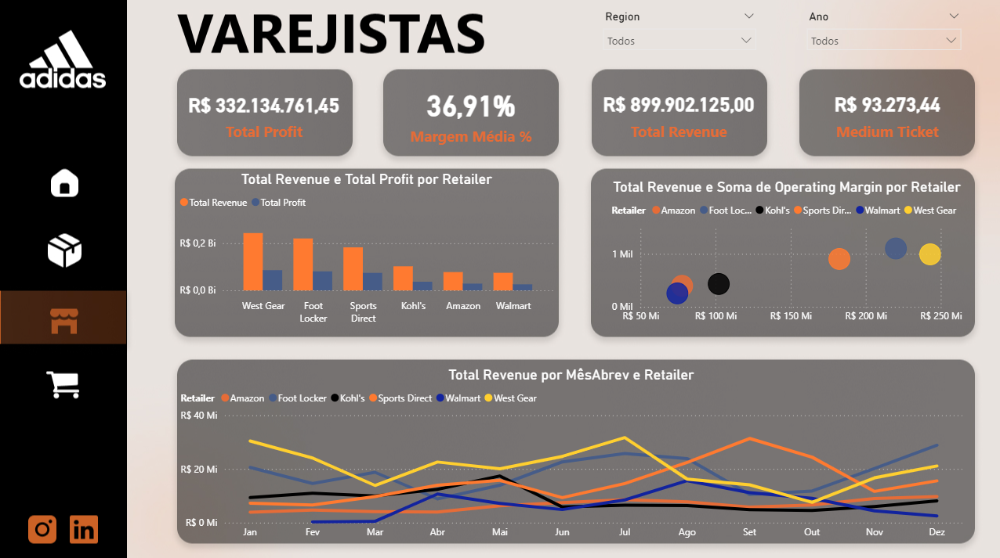
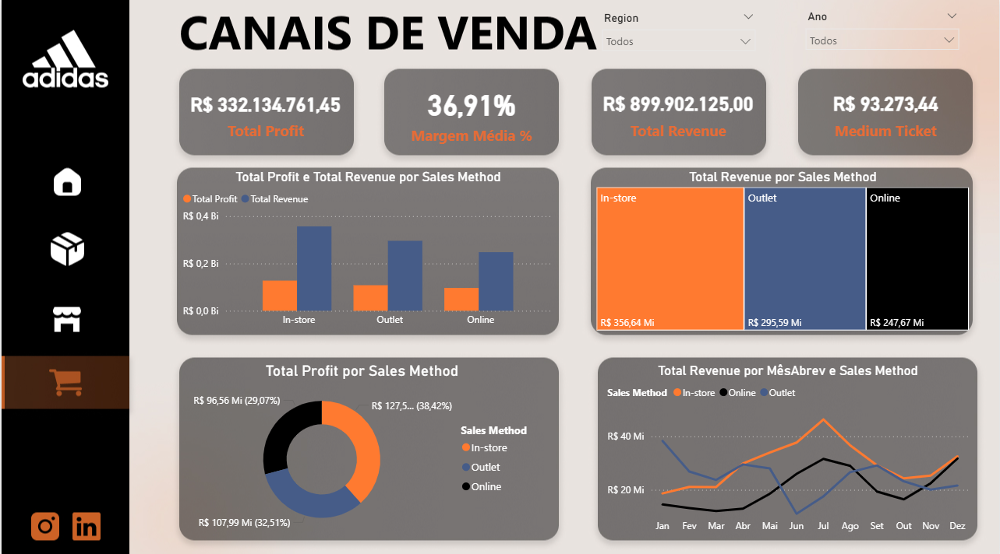

# 📊 Adidas Sales Dashboard – Power BI

Este projeto consiste em um **dashboard interativo desenvolvido em Power BI**, com dados de vendas da Adidas.  
O objetivo é fornecer uma visão clara e estratégica sobre o desempenho de vendas, produtos, varejistas e canais de distribuição, ajudando na análise e tomada de decisão.

---

## 🚀 Objetivos do Projeto
- Consolidar informações de vendas da Adidas em um painel interativo.  
- Monitorar os principais **KPIs de negócio**.  
- Fornecer insights sobre desempenho por **produto, canal e varejista**.  
- Criar um design consistente inspirado na identidade visual da marca (protótipo no **Figma**).  

---

## 🖼️ Estrutura do Dashboard

### 🔹 Página Inicial
  
Tela de abertura inspirada na identidade visual da Adidas, com navegação clara para as demais páginas.  

### 🔹 Visão Geral
  
- KPIs principais: Receita Total, Lucro Total, Margem Média e Ticket Médio.  
- Evolução mensal da receita em gráfico de linhas.  
- Mapa geográfico mostrando distribuição das vendas por região.  

### 🔹 Produtos
  
- Receita e lucro por categoria de produto.  
- Quantidade de unidades vendidas.  
- Destaque para produtos mais lucrativos e populares.  

### 🔹 Varejistas
  
- Comparação de receita entre os principais parceiros (Amazon, Walmart, Foot Locker, etc.).  
- Margem de lucro e participação percentual de cada varejista.  

### 🔹 Canais de Venda
  
- Distribuição das vendas por canal (In-store, Outlet e Online).  
- Identificação do canal mais rentável.  

---

## 📂 Estrutura do Repositório

## 🛠️ Tecnologias Utilizadas
- **Figma** → prototipagem e design visual.  
- **Excel** → tratamento e fornecimento da base de dados.  
- **Power BI** → modelagem de dados e construção do dashboard.  

---

## 📈 Principais KPIs Monitorados
- Receita Total (**Total Revenue**)  
- Lucro Total (**Total Profit**)  
- Margem Média (%)  
- Ticket Médio  

---

## ✨ Diferenciais do Projeto
- Paleta de cores inspirada na **identidade visual da Adidas**.  
- Estrutura de navegação em múltiplas páginas.  
- Protótipo criado no **Figma** antes da implementação no Power BI.  
- Uso de **gráficos estratégicos** (TreeMap, Mapas, Séries Temporais, KPI Cards).  
- Foco em **tomada de decisão executiva**.  

---

## 📌 Como visualizar
1. Baixe o arquivo `dashAdidas.pbix` na pasta **/arquivos**.  
2. Abra no **Power BI Desktop**.  
3. Explore as páginas e interaja com os filtros disponíveis.  

---

## 👨‍💻 Autor
**Leandro Sena**  
[LinkedIn](https://www.linkedin.com/in/leandrosena7/) | [GitHub](https://github.com/Leozz7)  

---
